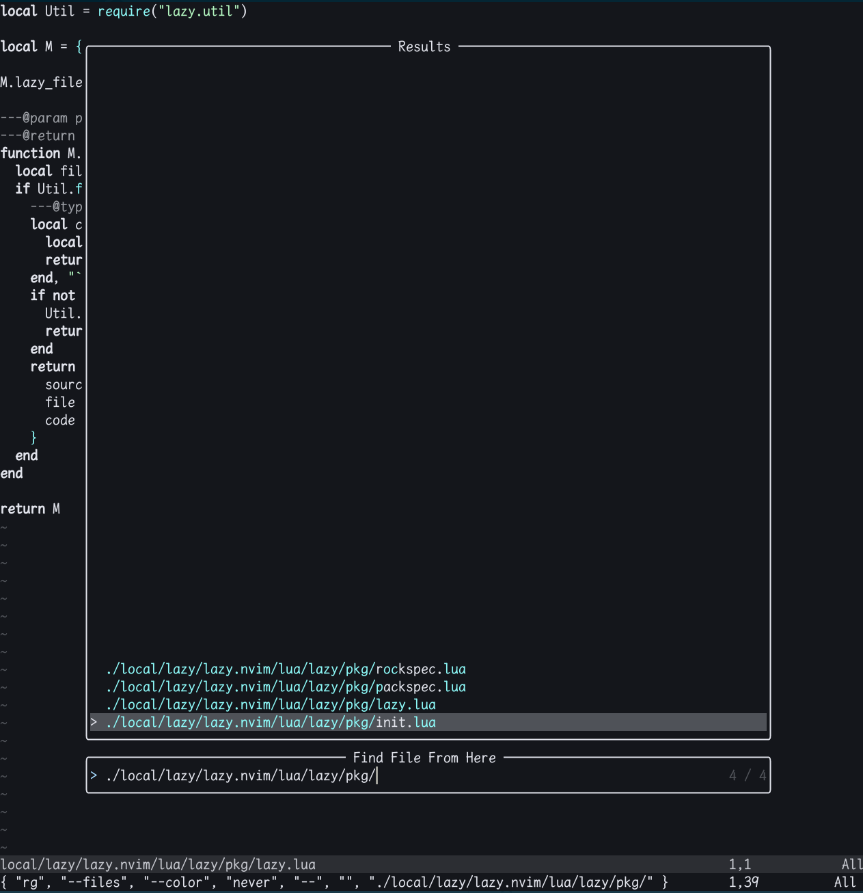
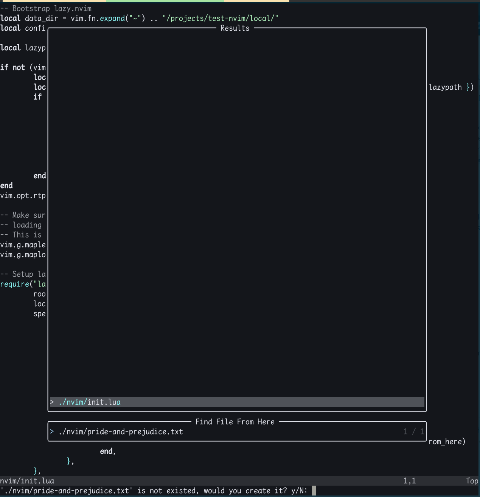

# find-file.nvim

Inspired by emacs `M-x find-file`(C-x C-f).

# Install

lazy.nvim:
```lua
{
    "youguanxinqing/find-file.nvim",
    dependencies = { "nvim-telescope/telescope.nvim" },
    config = function()
        -- binding command `:FindFile`
        vim.api.nvim_create_user_command(
            "FindFile",
            'lua require("find-file").find_file_from_here()',
            { bang = true }
        )
        -- binding shortcut
        vim.keymap.set("n", "<leader><space>", require("find-file").find_file_from_here)
    end,
},
```

# Doc

To press `<leader><leader>`, find files under current directory.


To press `<C-a>` in input box, create new file or new directory if the path does not exist after getting your `y`(yes).

